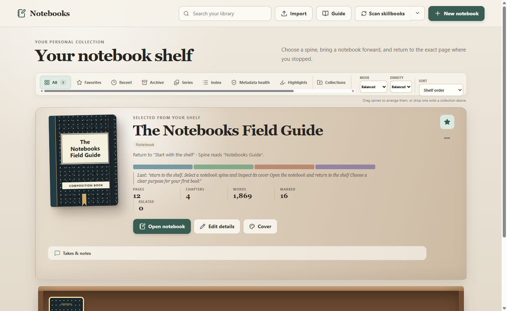
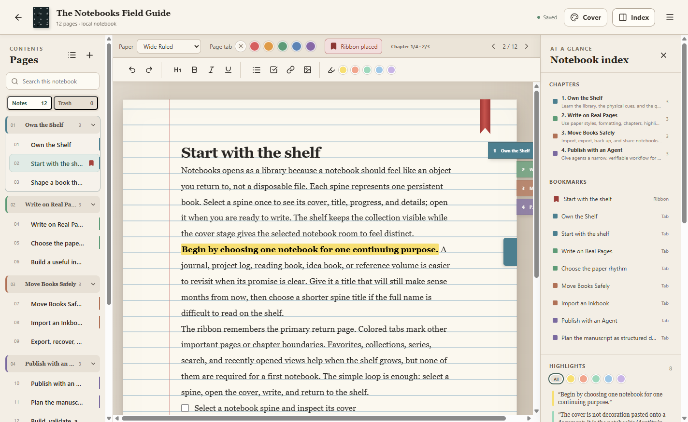
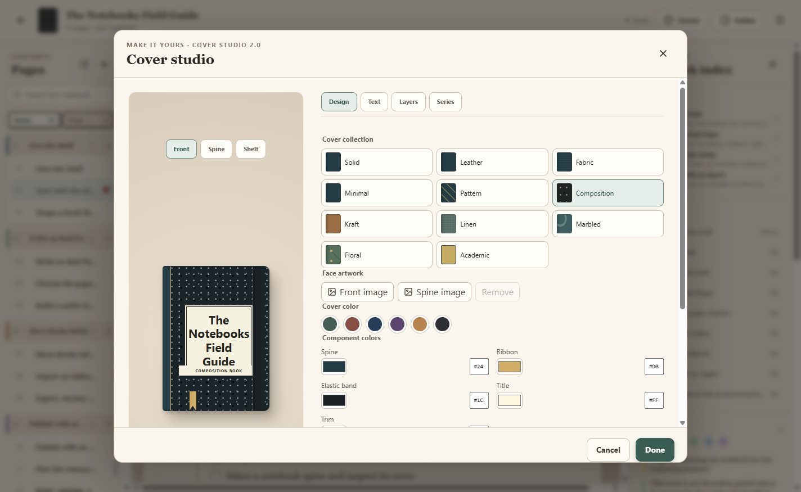

# Notebooks

Notebooks is a Windows desktop writing app built around a physical bookshelf, collectible covers, finite pages, and useful landmarks. It is designed to feel personal and tactile while remaining fast enough for everyday writing.

> Public testing preview — version 0.6.1. Keep an exported backup of important notebooks.

## Download for Windows

Download **Notebooks-Setup-0.6.1.exe** from the [latest GitHub Release](https://github.com/Romadethat/Notebooks/releases/latest).

- Platform: Windows x64
- Installer size: 122,687,136 bytes (about 117 MB)
- SHA-256: `8E9AA52471B227B6354B870A0428B3C1DE6E913DE544425FC291800D1A05C394`
- Signing status: unsigned preview build

Windows may display an unknown-publisher warning because this preview is not yet code-signed. Verify the checksum before installing if you downloaded the installer from anywhere other than the official release page.

## What you can do

- Build a personal library using shelf, spine, grid, collection, series, favorite, archive, search, and recent views
- Create covers using colors, materials, patterns, composition styles, academic styles, and uploaded images
- Write on blank, college ruled, wide ruled, narrow ruled, legal, or custom paper
- Let text follow the ruled baseline and continue onto new finite pages automatically
- Organize books with chapters, ribbon bookmarks, colored page tabs, and the Notebook Index
- Collect highlights, checklists, images, and recently edited pages in one place
- Import and export portable `.inkbook` books, or export a fixed PDF copy
- Recover work through autosave, trash recovery, and recovery points

## Install and begin

1. Download the installer from **Releases**.
2. Run `Notebooks-Setup-0.6.1.exe` and complete the Windows installer.
3. Open Notebooks to enter the bookshelf.
4. Choose **New notebook** to create a book, or choose **Guide** to preview and import the Notebooks Field Guide.
5. Select a book on the shelf, then open its cover to start writing.

The complete walkthrough is in the [User and Agent Guide](docs/USER_AND_AGENT_GUIDE.md).

## Public companion book

[Download the Notebooks Field Guide](downloads/Notebooks-Field-Guide.inkbook) and import it from the library. It teaches users and writing agents how the shelf, paper, pages, chapters, marks, import, and export systems work.

## Privacy and release scope

Notebooks is local-first. Personal shelf data and private notebooks are not included in this repository or the installer. This repository intentionally contains product information, public screenshots, documentation, and the public companion book—not the application source code.

The preview is provided for evaluation and testing. Source reuse and redistribution rights have not been granted. See [Security](SECURITY.md) for responsible reporting and the [Public Release Audit](docs/PUBLIC_RELEASE_AUDIT.md) for current verification details.

Found a problem or have an idea? Open an [issue](https://github.com/Romadethat/Notebooks/issues).
